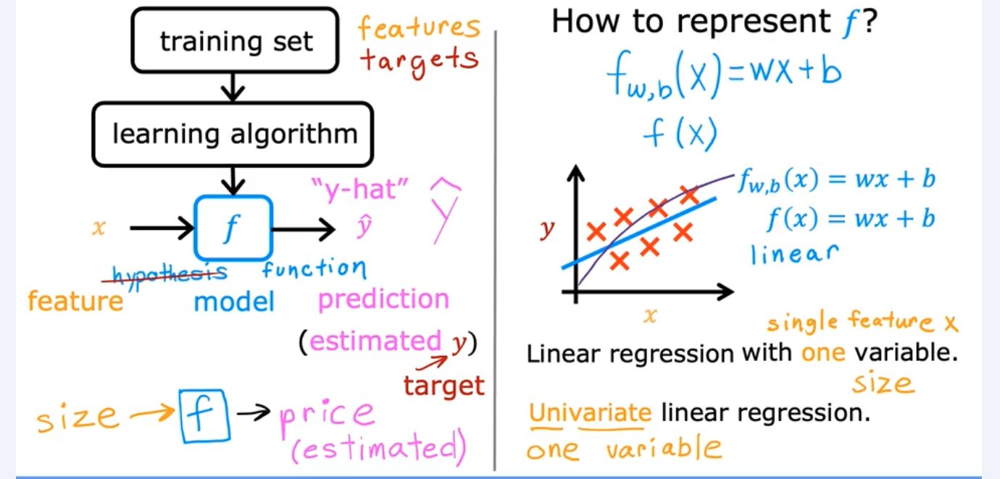
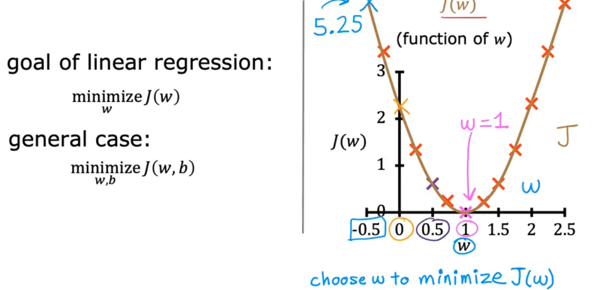

# Machine Learning Specialization course - Notes
This repository contains the notes and key concepts from below resources 
1) Machine Learning Specialization course by Andrew Ng on Coursera.
2) Hands-on Machine Learning with Scikit-Learn, Keras & TensorFlow by Aurélien Géron.
3) my own general research on the web and different books.

# Module 1: Supervised Machine Learning: Regression and Classification

🎯Q. What is machine learning?

- Machine Learning is the `science (and art) of programming computers` so they can learn from data.
- Machine learning is the field that gives abilities to computers to learn without being explicitly programmed. - Arthur Samuel (1959)
- ⭐⭐Machine learning⭐ and ⭐deep learning⭐ are fields aimed at `implementing algorithms` that enable computers to learn from data and perform tasks that typically require human intelligence.⭐
- There are below main types of machine learning:
  - Supervised Learning
  - Unsupervised Learning
  - Reinforcement Learning
- Each type has its own unique characteristics and applications.

🎯Q. What is supervised learning in ML? Different types (3 key types)

- `supervised learning` is an algorithm which maps input X to output Y, where the learning algorithm learns from the "right answers" (labeled data).
- `Supervised learning` is a type of machine learning where the model is trained on a labeled dataset, meaning that each training example is paired with an output label.

- `Two main types of Supervised Learning` - 
  - `Regression` - Predicting continuous values (e.g., house prices, stock prices).
  - `Classification` - Predicting discrete labels or categories (e.g., spam detection, image recognition).

⭐⭐ Regression supervised learnning ⭐⭐
- `Regression meaning` - Its finding the relationship which explains how one element depends on another. 
  - `Regression` also means trying to `predict a number` from infinitely `possible outputs`.
  - `Example` - Predicting house prices based on features like size, location, number of rooms, etc.
  - in ecommerce , given input features of user, product, context, predict purchase amount.

⭐⭐ Classification supervised learning ⭐⭐
- `Classification meaning` - Its finding the relationship which explains how one element belongs to a particular category or class.
  - `Classification` also means trying to `predict a label` from a `finite set of possible outputs`.
  - `Example` - Email spam detection (spam or not spam), image recognition (cat, dog, car, etc.)
    - in ecommerce , given input features of user, product, context, predict whether user will buy the product (yes/no)

- IMP One liners - 
- 💡 Its not always finding the straight line in supervised learning regression; this can be polynomial, logarithmic, exponential, etc.
- Classification algorithms predicts categories / classes / labels unlike regression which predicts continuous values( e.g., real numbers).

🎯Q. What is unsupervised learning in ML?

- In `unsupervised learning` we ask algorithms to find something intresting in unlabeled data. (interesting patterns) Where in `supervised learning` the algorithm learns from the labeled data.
- Examples 
  - `Anomaly detection` - identifying unusual data points that do not conform to expected behavior. Example - fraud detection in financial transactions.
  - `Clustering` - grouping similar data points together based on their features. Example - customer segmentation in marketing.
  - `Dimensionality reduction` - compress data using fewer numbers, reducing the number of features in a dataset while preserving important information. Example - Principal Component Analysis (PCA) for image compression.

🎯Q. what is meaning of `regression` in machine learning?

- In machine learning "regression" mean predicting continuous values based on input features.
- 

🎯Q. What is linear regression model?

- Linear regression model is a type of regression model that assumes a linear relationship between the input features (independent variables) and the output variable (dependent variable). Meaning it tries to fit a straight line (or hyperplane in higher dimensions) to the data points.
- The goal of linear regression is to find the best-fitting line that minimizes the difference between the predicted values and the actual values in the dataset. 
- 
- For linear regression, the model is represented by:

  **fw,b(x)(i) = wx(i) + b**

  Where:
  - **fw,b(x)** is the prediction function
  - `w` is the weight/slope parameter
  - `b` is the bias/y-intercept parameter
  - `x` is the input feature
- The formula above is how you can represent straight lines - different values of  𝑤 and  𝑏 give you different straight lines on the plot.
- The formula can be used to predict outcomes based on input features, making it a fundamental concept in machine learning.
- 
- 
- 

🎯Q. what is cost function ?

- Excellent visualization in this video : https://www.youtube.com/watch?v=3dhcmeOTZ_Q&t=35s
- Given b and w , cost function helps us to understand how good or bad our model is performing. This is by measuring the difference between predicted 
  values and actual values.
- The goal of linear regression is to find the parameters `w` and `b` that results in smallest possible value for the cost J.
- 
- 
- 
- 
- 
- 
- 
- Cost and MOdel examples below
- 
- 
- 

🎯Q. what is gradient descent ?

- Excellent video here - https://www.youtube.com/watch?v=sDv4f4s2SB8
- `Gradient descent` is an optimization algorithm used to minimize the cost function by iteratively adjusting the model parameters (like `w` and `b` in linear regression) in the direction of the steepest descent of the cost function.
- 
- 
  - In Above diagram, "alpha" controls `how big a step` we take on each iteration towards the minimum.
  - If `"alpha"` is too small, the algorithm will take a long time to converge.
  - If `"alpha"` is too large, the algorithm may overshoot the minimum and fail
  - If `"alpha"` is just right, the algorithm will converge quickly to the minimum.
  - `derivative` tell us in which direction to adjust the parameters to reduce the cost.
  - `"derivative"` is the `slope of the cost function at the current point`.
  - `alpha * derivative` gives the amount to adjust the parameters (step size) per iteration.
- 
- 
- 
- 
- In below diagram, we can see until to find the global minimum point of cost function, we need to keep updating w and b values using gradient descent algorithm.
- 
- In `batch gradient descent`, we use the entire training dataset to compute the gradient of the cost function for each iteration. This means that for every update of the model parameters, we consider all training examples. Meaning in gradient descent we have algorithms to calculate the W and B here it use entire batch of data to compute the gradient of the cost function for each iteration.

🎯Q. what is learning rate? 

- The `learning rate` (denoted as `α` or "alpha") is a hyperparameter that controls the step size at each iteration while moving toward a minimum of a loss function during the training of a machine learning model.
- 
- 

🎯Q. Linear regression with multiple features? how its denoted ?

- `connecting with the intuition of the dot product` : As dot product measures the similarity between two vectors, multiplying all input X features with their corresponding weights W and summing them up gives us a weighted sum that represents the model's prediction.
- 
- 
- 
- 
- Vectorization benifits - make code shorter, also makes code run faster by leveraging optimized linear algebra libraries which use parallel hardware capabilities.

🎯Q. Why vectorization is fast compared to normal computation?

- 
- 

🎯Q. Gradient descent for multiple linear regression with vectorization ?

- 
- 
- 
- 

🎯Q. what is feature scaling and why its important ?

- Feature scaling is a technique used to standardize the range of independent variables or features of data. In machine learning, it is important because many algorithms are sensitive to the scale of the input features. If the features are on different scales, it can lead to suboptimal performance and convergence issues during training.
- 
- 
- If we use training data as it is, features with larger scales can dominate the learning process, making it difficult for the model to learn from features with smaller scales.
- check below example, on why we need feature scaling? without feature scaling, gradient descent may take longer to converge or may not converge at all. (converge : means in layman terms - reach to the optimal solution, in our case optimal values of W and B)
- In below example snap observe how contours are elongated ellipses, indicating that the cost function changes more rapidly in one direction than the other. This can lead to slow convergence because gradient descent will take small steps in the direction of the steepest slope, which may not be aligned with the direction of the minimum.
- 
- 
- 
- 
- 
- Different methods of feature scaling - 
  - Min-Max Scaling (Normalization)
  - Standardization (Z-score normalization)
  - Robust Scaling
  - Max Abs Scaling

🎯Q. How we would know scaling actually worked ? meaning how can we tell our gradient descent is converging?

- Job of the gradient descent is to define the parameters w and b such that hopefully minimize the the cost function J(w,b).
- 
- 
- 

🎯Q. what is feature engineering ?

- Feature engineering is the process of using domain knowledge to select, modify, or create new features from raw data to improve the performance of machine learning models.
- It involves techniques such as feature selection, feature extraction, and feature transformation to enhance the quality and relevance of the input data used for training.
- Effective feature engineering can lead to better model accuracy, reduced overfitting, and improved interpretability of the results.
- 

🎯Q. what is polynomial regression ?

- Polynomial regression is an extension of linear regression that allows us to model non-linear relationships between the input features and the output variable by introducing polynomial terms. Essentially, it fits a curve to the data instead of a straight line.
- 
- 

🎯Q. what is logistic regression algorithm why its used ?

- Logistic regression is a statistical method used for binary classification problems, where the goal is to predict one of two possible outcomes (e.g., yes/no, true/false, 0/1) based on input features.
- 
- why linear regression does not work for classification problem ? because linear regression can produce values outside the range of 0 to 1, which are not valid probabilities. Logistic regression addresses this issue by using the logistic (sigmoid) function to map predicted values to probabilities between 0 and 1.
- 
- check below snap for how logistic regression formula is derived
- 
- 
- 
- 
- 
- 
- 
- This is excellent video to understand what is sigmoid function - https://www.youtube.com/watch?v=yIYKR4sgzI8
- In essence: sigmoid turns linear regression’s output → into a probability → which makes logistic regression suitable for classification.

🎯Q. what is decision bounday and how its calculated ?

- 
- 
- 

🎯Q. Cost function for the logistic regression ?

- why seuqred error is not a good choice ? check below snap
- 
- Remember the loss function measures how well you are doing on a one training example and is by `summing up` the losses of all training examples we get the cost function. Meaning it sums up the loss over all training examples keeping one example at a time to calculate the total loss.
- 
- 
- 
- 
- 

🎯Q. Gradient descent for logistic regression ?

- 
- 

🎯Q. what is overfitting and how to manage it ?

- 
- overfit = high variance similarly underfit = high bias
- 
- addressing overfitting techniques 
- 
- 
- 
- 

🎯Q. what regularization technique and its use ?

- Regularization is a technique used in machine learning to prevent overfitting by adding a penalty term to the loss function. This penalty discourages the model from fitting the training data too closely, which can lead to poor generalization on unseen data.
- 
- 

 
 

# Module 2: Advanced Learning Algorithms

🎯Q. what is neuron and neural network?

- A `neuron` is a fundamental unit of a neural network that processes and transmits information. It receives input signals, applies a mathematical function (activation function) to these inputs, and produces an output signal that is passed to other neurons in the network.
- 
- 
- 
- 
- 
- 
- 
- 

🎯Q. what is forward prapogation ?

- Its an algorithm to calculate the output of neural network given input features and weights and biases of each neuron.
- We can download the weights and biases after training the model and use those to make predictions on new data using forward propagation.
- `Forward propagation` is the process by which `input data is passed through a neural network to generate an output`. It involves calculating the weighted sum of inputs, applying activation functions, and propagating the results through each layer of the network until the final output is produced. As its from left to right direction its called `forward propagation`.
- Remember forward prapogration is different then backpropogation.
  `Forward prapogation` - use for `making predictions`.
  `Backpropogation` - use for `training the model`.

- Example below : 
- 
- 
- 

🎯Q. How model is pragrammed in tensorFlow? 

- 
- 
- 
- 
- 
- 
- 

🎯Q. Building a neural network using tensorFlow techniques? 

- 
- 
- 
- 

🎯Q. Forward prapogation math behind the scene imple just by using python and numpy to build the intuition

- 
- 
- 💡 Think of `dense as a calculator that uses W and b to compute outputs`. The process of learning these values is handled by the training algorithm outside the dense function. This step adjusts W and b to minimize the loss.
- Inside tensorflow library, dense layer does forward prapogation by calculating the weighted sum of inputs and adding bias, then applying activation function to produce output.
- 

🎯Q. what does activation function mean actually in forward propagation 

- 
- 

🎯Q. Does forward prop consider defauly W and B values initially ? why?

- 
- 
- 

🎯Q. Matrics operations revision

- 
- 
- 
- 
- 
- 

🎯Q. Training a neural network in tensorflow 3 key steps understanding

- 
- `step 1` : specifiy the model which tells tensorflow how to compute for inference (forward prapogation)
- `step 2` : compiles the model using specific loss function
- `step 3` : train the model using training data, which internally uses backpropogation to update W and B values to minimize the loss function.
- 
- 
- 
- 

🎯Q. Alternative to sigmoud activation in neural network

- 
- `ReLU activation function` - A popular activation function that introduces non-linearity by outputting the input directly if it is positive; otherwise, it outputs zero.
- Most commonly used activation functions
- 

 
 

# General Notes on Machine Learning

- Applying ML techniques to dig into large amounts of data can help discover patterns that were not immediately apparent. This is called `data mining`.
- ⭐Remember the `loss function measures` how well you are doing on `one training example` and by summing up the losses of all training examples we get the `cost function`.⭐

🎯Q. Difference Linear Regression vs Neural Network 

- 

 
 
 
********************************* Ignore below *********************************

Emojis used

⭐ - For important points
🔥 - super important
💡 - For key concepts/tips
⚠️ - For warnings/common mistake
🎯 - For exam targets/focus areas/ question 
🚀 - For advanced topics .
🚫 - For indicating something that cannot be used or a concerning point

🎯Q. fsdfsdf

- 

